# NVIDIA Startup AI Radar — Toph

Plataforma multiagente para encontrar startups brasileiras com sinais de IA, classificar seu nível de maturidade AI-native e recomendar tecnologias NVIDIA personalizadas.

**Toph** (codinome do frontend) — nome inspirado na personagem de Avatar que sente vibrações na terra, como o radar sente sinais de IA nas startups.

---

## Como o sistema funciona

O sistema é um pipeline de 8 agentes orquestrados por LangGraph:

```
1. Search Planner  → 2. Scraper  → 3. Extractor  → 4. Classifier
                                                         ↓
5. Validator  →  6. RAG NVIDIA  →  7. Recommendation  →  8. Briefing
```

Para cada startup, o Search Planner gera queries inteligentes usando o nome da startup + termos do setor. O Scraper busca na web (SerpAPI ou DuckDuckGo) e coleta páginas (Playwright). O Extractor usa Groq LLM para extrair dados estruturados. O Classifier decide se a startup é AI-Native, AI-Enabled ou Non-AI. O Validador checa evidências mínimas. O RAG consulta uma base de conhecimento NVIDIA (Qdrant). O Recommendation mapeia gaps → tecnologias NVIDIA. O Briefing gera um relatório executivo.

---

## Stack completa

### Orquestração e Backend

| Categoria | Tecnologia | Função |
|---|---|---|
| Orquestração de agentes | **LangGraph** | Grafo de estados que coordena os 8 agentes do pipeline |
| Backend | **Python 3.12 + FastAPI** | API REST com endpoints para executar pipeline, consultar resultados |
| Banco de dados | **SQLite** | Persistência local de runs, startups, fontes, evidências, recomendações |
| Migrações de schema | **Alembic** | Versionamento do schema do banco SQLite |
| Testes | **pytest + ruff** | ~165 testes, lint via ruff |

### Search Providers (Busca na web)

| Provider | Mecanismo | Uso |
|---|---|---|
| **SerpAPI** | API paga do Google | Search provider primário. Retorna resultados de busca Google (melhor cobertura BR) |
| **DuckDuckGo** | API gratuita (`ddgs`) | Fallback. Usa motor de busca Bing via DuckDuckGo. Sleep de 2s entre queries para evitar rate limit |
| **Firecrawl** | API de busca+scraping (paga) | Alternativo. Pode fazer busca e scraping no mesmo provider |
| **Fixture** | Dados mockados | Modo offline para testes sem rede. Usa `StaticSeedCollector` |

### Page Providers (Coleta de páginas)

| Provider | Mecanismo | Uso |
|---|---|---|
| **Playwright** | Chromium headless + trafilatura | Page provider primário. Abre navegador real, executa JS, extrai HTML, depois trafilatura extrai texto limpo |
| **Firecrawl** | API de scraping (paga) | Alternativo. Faz scraping via API, retorna markdown/HTML |
| **trafilatura** | Biblioteca Python | Usado como extrator de texto limpo dentro do Playwright. Extrai conteúdo sem navegação/navbar |
| **Fixture** | Dados mockados | Modo offline |

### LLM Providers (Inteligência Artificial)

| Provider | Modelo | Uso |
|---|---|---|
| **Groq** | Llama 3.3 70B | LLM primário. Rápido (~1000 tok/s). Usado no Extractor e Classifier |
| **OpenAI** | GPT-4o-mini | Primeiro fallback se Groq falhar |
| **Gemini** | Gemini 2.0 Flash | Segundo fallback |

### Retrieval-Augmented Generation (RAG)

| Componente | Função |
|---|---|
| **Qdrant** (in-memory) | Armazena 16 chunks de conhecimento NVIDIA (NIM, NeMo, CUDA, Riva, etc.) como vetores |
| **sentence-transformers** (all-MiniLM-L6-v2) | Gera embeddings dos chunks e da query de busca |
| **Fallback determinístico** | Quando a busca vetorial retorna 0 chunks, mapeia keywords das evidências → chunks relevantes |

### Frontend

| Categoria | Tecnologia |
|---|---|
| Framework | **React 18 + TypeScript** |
| Bundler | **Vite** |
| Roteamento | **TanStack Router** |
| Componentes | **shadcn/ui** + **Radix UI** |
| Gráficos | **Recharts** |
| Data fetching | **TanStack React Query** |
| CSS | **Tailwind CSS** |

---

## Como inicializar localmente

> Use PowerShell no Windows. Sempre use o Python do venv do projeto para o backend.

### 1. Backend FastAPI

```powershell
cd ai-agent-system
..\venv\Scripts\python.exe run_server.py
```

O servidor inicia em `http://127.0.0.1:8000`. Verifique se está online:

```powershell
Invoke-WebRequest -UseBasicParsing http://127.0.0.1:8000/health
Invoke-WebRequest -UseBasicParsing http://127.0.0.1:8000/health/db
Invoke-WebRequest -UseBasicParsing http://127.0.0.1:8000/providers/preflight
```

### 2. Frontend React

```powershell
cd frontend
npm run dev
```

Abra `http://localhost:5173`.

### 3. Teste rápido do pipeline

```powershell
$body = '{ "query": "startup brasileira de IA", "startup_name": "Fintalk" }'
Invoke-WebRequest -UseBasicParsing -Uri http://127.0.0.1:8000/runs -Method POST -ContentType "application/json" -Body $body
```

Acompanhe o progresso:

```powershell
Invoke-WebRequest -UseBasicParsing http://127.0.0.1:8000/runs/1
```

### 4. Pipeline batch (múltiplas startups)

```powershell
$body = '{ "startups": [ { "startup_name": "Fintalk", "query": "startup brasileira IA" }, { "startup_name": "Gupy", "query": "plataforma recrutamento IA" } ] }'
Invoke-WebRequest -UseBasicParsing -Uri http://127.0.0.1:8000/batches -Method POST -ContentType "application/json" -Body $body
```

Acompanhe:

```powershell
Invoke-WebRequest -UseBasicParsing http://127.0.0.1:8000/batches/1
```

---

## Configuração (`.env`)

Crie um arquivo `.env` na raiz do repositório:

```env
# Obrigatório: ativa provedores externos
RADAR_ENABLE_EXTERNAL_PROVIDERS=true

# Search provider: serpapi (primário), duckduckgo (fallback), firecrawl, fixture
RADAR_SEARCH_PROVIDER=serpapi

# Page provider: playwright (primário), firecrawl, fixture
RADAR_PAGE_PROVIDER=playwright

# LLM provider: groq (primário), openai, gemini
RADAR_LLM_PROVIDER=groq
RADAR_LLM_FALLBACKS=["openai","gemini"]

# Chaves de API (pelo menos 1 do search + 1 do LLM)
SERPAPI_API_KEY=seu_token_aqui
GROQ_API_KEY=gsk_xxxxxxxxxxxxxxxx
OPENAI_API_KEY=sk-xxxxxxxxxxxxxxxx
GEMINI_API_KEY=AIzaxxxxxxxxxxxxxxxx
```

### Safety Switch

`RADAR_ENABLE_EXTERNAL_PROVIDERS=false` → nenhuma API externa roda. Extractor e Classifier usam código determinístico (regex/scoring). Necessário para testes offline.

### Provedores Suportados

| Provider | Categoria | Search | Page | LLM |
|---|---|---|---|---|
| `fixture` | Mock (teste) | StaticSeedCollector | HtmlPageContentAdapter | Determinístico |
| `serpapi` | Busca Google | ✅ (API) | — | — |
| `duckduckgo` | Busca Bing | ✅ (grátis) | — | — |
| `firecrawl` | Busca + Scraping | ✅ | ✅ | — |
| `playwright` | Scraping browser | — | ✅ (Chromium) | — |
| `groq` | LLM | — | — | Llama 3.3 70B |
| `openai` | LLM | — | — | GPT-4o-mini |
| `gemini` | LLM | — | — | Gemini 2.0 Flash |

---

## API Endpoints

| Método | Rota | Descrição |
|---|---|---|
| `GET` | `/` | Raiz do serviço |
| `GET` | `/health` | Healthcheck básico |
| `GET` | `/health/db` | Healthcheck do banco (tabelas + tamanho) |
| `GET` | `/providers/preflight` | Status dos provedores externos |
| `POST` | `/runs` | Executa pipeline para 1 startup |
| `GET` | `/runs` | Lista execuções |
| `GET` | `/runs/{id}` | Detalhe da execução |
| `GET` | `/runs/{id}/sources` | Fontes coletadas |
| `GET` | `/runs/{id}/claims` | Evidências extraídas |
| `POST` | `/batches` | Executa pipeline para N startups |
| `GET` | `/batches/{id}` | Status do batch |
| `GET` | `/sources` | Lista todas as fontes |
| `GET` | `/startups` | Lista startups com radar_score |
| `GET` | `/startups/{id}` | Detalhe de uma startup |
| `GET` | `/startups/{id}/runs` | Execuções de uma startup |

---

## Páginas do Frontend

| Página | URL | Descrição |
|---|---|---|
| **Overview** | `/` | Dashboard com métricas, gráfico de maturidade, top startups |
| **Pipeline** | `/pipeline` | Executa pipeline com animação em tempo real |
| **Sources** | `/sources` | Auditoria de fontes coletadas, claims, export CSV |
| **Ranking** | `/ranking` | Tabela com ordenação, paginação, filtros, export CSV |
| **Startup Detail** | `/startup/$id` | Perfil completo, evidências, recomendações NVIDIA |
| **Briefing** | `/briefing` | Relatório executivo por startup |
| **Contacts** | `/contacts` | Gestão de contatos |
| **Profile** | `/profile` | Perfil do usuário (mock) |

---

## Comandos Úteis

```powershell
# Backend (terminal 1)
cd ai-agent-system
..\venv\Scripts\python.exe run_server.py

# Frontend (terminal 2)
cd frontend
npm run dev

# Testes
cd ai-agent-system
..\venv\Scripts\python.exe -m pytest

# Lint
..\venv\Scripts\python.exe -m ruff check src/radar/ tests/

# Migrações do banco
..\venv\Scripts\python.exe -m alembic -c src\radar\database\alembic.ini upgrade head

# Rollback
..\venv\Scripts\python.exe -m alembic -c src\radar\database\alembic.ini downgrade -1

# Resetar banco
Remove-Item ai-agent-system\src\radar\database\radar.db -Force

# Ver dependências
..\venv\Scripts\python.exe -m pip check
```

---

## Estrutura do Projeto

```text
InteliAcademy-ProjetoNvidia/
├── ai-agent-system/
│   ├── src/radar/
│   │   ├── agents/           # 8 agentes LangGraph (search_planner, scraper,
│   │   │                     #   extractor, classifier, validator, nvidia_rag,
│   │   │                     #   recommendation, briefing)
│   │   ├── api/              # FastAPI — app.py + rotas
│   │   ├── database/         # SQLite + Alembic (connection, repository)
│   │   ├── graph/            # LangGraph — state, nodes, edges, builder, progress
│   │   ├── llm/              # Adaptadores Groq/OpenAI/Gemini + prompts
│   │   ├── rag/              # Qdrant + sentence-transformers (retriever, enricher)
│   │   ├── schemas/          # Contratos Pydantic (startup, evidence, pipeline...)
│   │   └── scraping/         # Adaptadores SerpAPI/DuckDuckGo/Playwright/Firecrawl
│   ├── tests/                # ~165 testes
│   ├── docs/                 # Documentação complementar
│   ├── skills/               # Skills dos agentes de desenvolvimento
│   ├── run_server.py         # Script para iniciar servidor
│   └── requirements.txt
├── frontend/                 # React + Vite + TanStack + shadcn/ui
│   └── src/
│       ├── routes/           # 8 páginas
│       ├── components/       # UI components
│       └── lib/              # API client, hooks, utils
├── Documents/                # Relatório de Progresso, handoff, assets
├── .env                      # API keys (NÃO commitar)
├── .env.example              # Template de configuração
├── start.ps1                # Script de setup
└── README.md
```

---

## Fluxograma do Pipeline

```mermaid
graph TD
    Q[Consulta do Usuário] --> SP[Search Planner<br/>SerpAPI / DuckDuckGo]
    SP --> SC[Scraper<br/>Playwright + trafilatura]
    SC --> EX[Extractor<br/>Groq LLM / fallback regex]
    EX --> CL[Classifier<br/>Groq LLM / scoring]
    CL --> EV[Validator<br/>Regras de evidência]
    EV --> NV[RAG NVIDIA<br/>Qdrant + fallback keyword]
    NV --> RE[Recommendation<br/>Regras + LLM]
    RE --> BR[Briefing<br/>Relatório executivo]
    BR --> DB[SQLite<br/>Persistência]
    DB --> UI[Frontend Toph<br/>React]

    style Q fill:#1a1a2e,stroke:#76B900
    style UI fill:#1a1a2e,stroke:#76B900
    style DB fill:#1a1a2e,stroke:#76B900
```



---

## Estado do Projeto

| Fase | O que | Status |
|---|---|---|
| **1** | Estrutura base, schemas, LangGraph, validação | ✅ |
| **2** | Scraping real (SerpAPI, DuckDuckGo, Playwright) | ✅ |
| **3** | LLM no Extractor e Classifier (Groq + fallback) | ✅ |
| **4a** | RAG NVIDIA (Qdrant + sentence-transformers) | ✅ |
| **4b** | Frontend Toph completo (7 páginas API-driven) | ✅ |
| **5** | Migrações versionadas (Alembic), healthcheck | ✅ |
| **6** | PlaywrightPool (browsers reutilizáveis) | 🔄 |
| **7** | Batch endpoint (múltiplas startups) | 🔄 |

---

## Testes

```powershell
cd ai-agent-system
..\venv\Scripts\python.exe -m pytest
..\venv\Scripts\python.exe -m ruff check src/radar/ tests/
```
