# NVIDIA Startup AI Radar — Toph

Plataforma multiagente para encontrar startups brasileiras com sinais de IA, classificar seu nível de maturidade AI-native e recomendar tecnologias NVIDIA personalizadas.

**Toph** (codinome do frontend) — nome inspirado no personagem Avatar que sente vibrações na terra, como o radar sente sinais de IA nas startups.

---

## Stack

| Camada | Tecnologia |
|---|---|
| Orquestração | LangGraph (8 agentes) |
| Backend | Python 3.12 + FastAPI |
| Frontend | React + TanStack Router + shadcn/ui + Recharts |
| Banco | SQLite (dev) / PostgreSQL (futuro) |
| Vetorial | Qdrant + sentence-transformers (all-MiniLM-L6-v2) |
| Scraping | Firecrawl / Playwright / trafilatura |
| LLM | Groq (primário) → OpenAI → Gemini (fallback) |
| Migrações | Alembic |

---

## Fluxograma do Pipeline

```mermaid
graph TD
    Q[Consulta do Usuário] --> SP[Search Planner<br/>Firecrawl Search]
    SP --> SC[Scraper Agent<br/>Firecrawl / Playwright]
    SC --> EX[Extractor Agent<br/>Groq LLM]
    EX --> CL[Startup Classifier<br/>Groq LLM]
    CL --> EV[Evidence Validator<br/>Regras + LLM]
    EV --> NV[NVIDIA RAG Agent<br/>Qdrant + embeddings]
    NV --> RE[Recommendation Agent<br/>Regras + LLM]
    RE --> BR[Briefing Agent<br/>Montagem]
    BR --> API[FastAPI<br/>Persiste no SQLite]
    API --> UI[Frontend Toph<br/>7 páginas React]

    style Q fill:#1a1a2e,stroke:#76B900
    style UI fill:#1a1a2e,stroke:#76B900
    style API fill:#1a1a2e,stroke:#76B900
```



### Agentes

| # | Agente | Função | Provedor |
|---|---|---|---|
| 1 | **Search Planner** | Transforma consulta em estratégia de busca | Firecrawl |
| 2 | **Scraper** | Coleta páginas públicas | Firecrawl / Playwright |
| 3 | **Extractor** | Extrai nome, setor, produto, founders, funding, tecnologias | Groq / fallback determinístico |
| 4 | **Classifier** | Classifica AI-Native / AI-Enabled / Non-AI com justificativa | Groq / fallback scoring |
| 5 | **Validator** | Valida quantidade, qualidade e consistência das evidências | Regras + LLM |
| 6 | **NVIDIA RAG** | Consulta base de conhecimento NVIDIA (NIM, NeMo, CUDA, etc.) | Qdrant + embeddings |
| 7 | **Recommendation** | Mapeia gaps → tecnologias NVIDIA com prioridade e complexidade | Regras + LLM |
| 8 | **Briefing** | Gera relatório executivo com evidências e recomendações | Montagem estruturada |

---

## Quick Start

### Pré-requisitos

- Python 3.12
- Node.js 18+
- `.env` configurado na raiz do repo (veja seção Configuração)

### 1. Backend (FastAPI)

```powershell
cd ai-agent-system
$env:PYTHONPATH = "$pwd\src"
..\venv\Scripts\python.exe -m uvicorn radar.api.app:app --reload --host 0.0.0.0 --port 8000
```

### 2. Frontend (Vite + React)

```powershell
cd frontend
npm run dev
```

### 3. Abrir

```
http://localhost:5173
```

### Script único de setup

```powershell
.\start.ps1
```

Mostra as instruções e roda as migrações do banco.

---

## Páginas do Frontend

| Página | URL | Descrição |
|---|---|---|
| **Overview** | `/` | Dashboard com métricas, gráfico de maturidade, top startups |
| **Pipeline** | `/pipeline` | Executa o fluxo multiagente com animação em tempo real |
| **Sources** | `/sources` | Auditoria de fontes coletadas, claims, export CSV |
| **Ranking** | `/ranking` | Tabela de startups com ordenação, paginação, filtros, export CSV |
| **Startup Detail** | `/startup/$id` | Perfil completo, evidências, recomendações |
| **Briefing** | `/briefing` | Relatório executivo gerado por startup |
| **Contacts** | `/contacts` | Gestão de contatos com status |
| **Profile** | `/profile` | Perfil do usuário (mock — sem auth) |

---

## API Endpoints

| Método | Rota | Descrição |
|---|---|---|
| `GET` | `/` | Raiz do serviço |
| `GET` | `/health` | Healthcheck básico |
| `GET` | `/health/db` | Healthcheck do banco (tabelas + tamanho) |
| `GET` | `/providers/preflight` | Status dos provedores externos |
| `POST` | `/runs` | Executa o pipeline (body: `{"query": "..."}`) |
| `GET` | `/runs` | Lista execuções |
| `GET` | `/runs/{id}` | Detalhe de uma execução com recomendações |
| `GET` | `/runs/{id}/sources` | Fontes coletadas em uma execução |
| `GET` | `/runs/{id}/claims` | Evidências extraídas em uma execução |
| `GET` | `/sources` | Lista todas as fontes |
| `GET` | `/startups` | Lista startups com radar_score |
| `GET` | `/startups/{id}` | Detalhe de uma startup |
| `GET` | `/startups/{id}/runs` | Execuções de uma startup |

---

## Estado do Projeto

| Fase | O que | Status |
|---|---|---|
| **1** | Estrutura base, schemas, LangGraph, validação, testes | ✅ |
| **2** | Scraping real (Firecrawl, Playwright, trafilatura) | ✅ |
| **3** | LLM no Extractor e Classifier (Groq + fallback) | ✅ |
| **4a** | RAG NVIDIA (Qdrant + sentence-transformers) | ✅ |
| **4b** | Frontend Toph completo (7 páginas API-driven) | ✅ |
| **5** | Migrações versionadas (Alembic), healthcheck, start.ps1 | ✅ |

---

## Comandos Úteis

```powershell
# Testes
cd ai-agent-system
..\venv\Scripts\python.exe -m pytest

# Lint
..\venv\Scripts\python.exe -m ruff check src/radar/ tests/

# Migrações do banco
..\venv\Scripts\python.exe -m alembic -c src\radar\database\alembic.ini upgrade head

# Rollback
..\venv\Scripts\python.exe -m alembic -c src\radar\database\alembic.ini downgrade -1

# Resetar banco
Remove-Item ai-agent-system\src\radar\database\radar.db -Force
```

---

## Configuração (`.env`)

```env
RADAR_ENABLE_EXTERNAL_PROVIDERS=true
RADAR_SEARCH_PROVIDER=firecrawl
RADAR_PAGE_PROVIDER=firecrawl
RADAR_LLM_PROVIDER=groq
RADAR_LLM_FALLBACKS='["openai","gemini"]'
FIRECRAWL_API_KEY=fc-xxxxxxxxxxxxxxxxxxxxxxxxxxxxxxxx
GROQ_API_KEY=gsk_xxxxxxxxxxxxxxxxxxxxxxxxxxxxxxxx
OPENAI_API_KEY=sk-xxxxxxxxxxxxxxxxxxxxxxxxxxxxxxxx
GEMINI_API_KEY=AIzaxxxxxxxxxxxxxxxxxxxxxxxxxxxxxxxx
```

### Safety Switch

`RADAR_ENABLE_EXTERNAL_PROVIDERS=false` (padrão) → nenhuma API externa roda. Extractor/Classifier usam código determinístico (regex/scoring). Útil para testes offline.

### Providers Suportados

| Provider | Search | Page | LLM |
|---|---|---|---|
| `fixture` | Mock (StaticSeedCollector) | Mock (HtmlPageContentAdapter) | Determinístico |
| `firecrawl` | FirecrawlSearchAdapter | FirecrawlPageAdapter | — |
| `playwright` | — | PlaywrightPageAdapter | — |
| `serpapi` | SerpApiSearchAdapter | — | — |
| `groq` | — | — | Llama 3.3 70B |
| `openai` | — | — | GPT-4o-mini |
| `gemini` | — | — | Gemini 2.0 Flash |

---

## Estrutura do Projeto

```text
InteliAcademy-ProjetoNvidia/
├── ai-agent-system/
│   ├── src/radar/
│   │   ├── agents/         # 8 agentes LangGraph
│   │   ├── api/            # FastAPI (app.py + rotas)
│   │   ├── database/       # SQLite + Alembic
│   │   ├── graph/          # State, nodes, edges, builder
│   │   ├── llm/            # Adaptadores Groq/OpenAI/Gemini + prompts
│   │   ├── rag/            # Qdrant + sentence-transformers
│   │   ├── schemas/        # Contratos Pydantic
│   │   ├── scraping/       # Adaptadores Firecrawl/Playwright
│   │   ├── services/       # Placeholder
│   │   └── utils/          # Placeholder
│   ├── tests/              # 129 testes
│   ├── docs/               # Documentação complementar
│   ├── skills/             # Skills dos agentes
│   └── requirements.txt
├── frontend/               # React + TanStack + shadcn/ui
│   └── src/
│       ├── routes/         # 8 páginas
│       ├── components/     # UI components
│       └── lib/            # API client, hooks, utils
├── Documents/              # Relatorio de Progresso, handoff
├── .env                    # API keys (NÃO commitar)
├── start.ps1              # Script de setup
└── README.md
```

---

## Testes

129 testes (1 flaky pre-existente):

| Suite | Tests |
|---|---|
| `test_extractor.py` | 11 |
| `test_classifier.py` | 7 |
| `test_llm_adapters.py` | 15 |
| `test_playwright_adapter.py` | 9 |
| `test_provider_factory.py` | 6 |
| `test_provider_preflight.py` | 7 |
| `test_scraping_adapters.py` | 8 |
| `test_source_normalizers.py` | 6 |
| `test_graph_mvp.py` | 3 |
| `test_evidence_pipeline.py` | 2 |
| `test_recommendation_mapping.py` | 8 |
| `test_retry_policy.py` | 3 |
| `test_briefing.py` | 2 |
| `test_external_provider_settings.py` | 4 |
| `test_api_preflight.py` | 1 |
| `test_api_crud.py` | 28 |
| `test_recommendation_mapping.py` | 8 |
| (outros) | + |

```powershell
cd ai-agent-system
..\venv\Scripts\python.exe -m pytest
```
